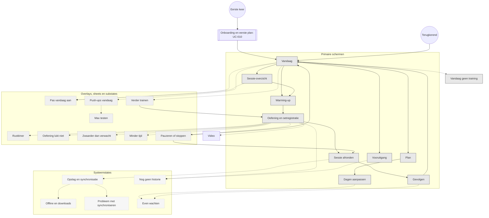

# Master screen map

Drie soorten schermen, en dat onderscheid is bewust: een wireframebestand is niet automatisch een
eigen scherm in het product.

- **Primair scherm** — een eigen plek in de app, met eigen navigatie.
- **Overlay / sheet / substate** — ligt over een primair scherm heen; de onderliggende context blijft.
- **Systeemstate** — een toestand van het systeem, geen bestemming. Hoort niet in de gewone navigatie.

De onboarding staat apart: die loopt één keer, vóór alles.

Doorgetrokken pijlen zijn echte navigatie. Stippellijnen openen iets over de huidige context heen,
of tonen een toestand van dat scherm.

## Twee routes vanaf Vandaag
De snelle route is de standaard: **Vandaag → Start training → Warming-up → Oefening**.
Het sessie-overzicht is extra uitleg voor wie wil zien wat er komt, geen verplichte tussenstap.

## Navigatie tijdens een actieve sessie
Drie verschillende handelingen, die nooit door elkaar mogen lopen:

| Handeling | Waar | Wat er gebeurt |
|---|---|---|
| Terug binnen een subflow | Sluitknop op elke sheet | Sheet gaat dicht, sessie ongemoeid |
| Minimaliseren | Rechtsboven op Warming-up en Oefening | Terug naar Vandaag, sessie blijft actief |
| Be&euml;indigen | Alleen via Pauzeren of stoppen | Afronden, afbreken, verplaatsen of overslaan |

Minimaliseren heet in de interface **Sessie blijft lopen**, en de sessie blijft daarbij zichtbaar op
het vergrendelscherm. Dat volgt Apple's patroon voor Live Activities: bedoeld voor taken met een
duidelijk begin en eind, met een workout als eerste voorbeeld in hun eigen richtlijn.

Een gewone terugknop verandert nooit de status van je training.

## Schermlijst

| Scherm | Bestand | Soort |
|---|---|---|
| Welkom | start.html | Primair (onboarding) |
| Doel | intake-doel.html | Primair (onboarding) |
| Ervaring | intake-ervaring.html | Primair (onboarding) |
| Dagen en tijd | intake-week.html | Primair (onboarding) |
| Waar en beperkingen | intake-context.html | Primair (onboarding) |
| Planvoorstel | plan-voorstel.html | Primair (onboarding) |
| Compromis | plan-compromis.html | Primair (onboarding) |
| Aanmelden | aanmelden.html | Primair (onboarding) |
| Klaarzetten | eerste-download.html | Primair (onboarding) |
| Vandaag | today.html | Primair |
| Sessie-overzicht | session-overview.html | Primair |
| Warming-up | warmup.html | Primair |
| Oefening | exercise.html | Primair |
| Sessie afronden | summary.html | Primair |
| Gevolgen | consequences.html | Primair |
| Plan | plan.html | Primair |
| Dagen aanpassen | plan-edit.html | Primair |
| Vooruitgang | progress.html | Primair |
| Vandaag geen training | today-rustdag.html | Primair (variant van Vandaag) |
| Rusttimer | rest.html | Substate van Oefening |
| Oefening lukt niet | swap.html | Sheet over Oefening |
| Zwaarder dan verwacht | hard.html | Sheet over Oefening |
| Minder tijd | adjust-time.html | Sheet over Vandaag of Oefening |
| Pauzeren of stoppen | interrupt.html | Sheet over Oefening |
| Pas vandaag aan | adjust.html | Sheet over Vandaag |
| Verder trainen | resume.html | Sheet over Vandaag |
| Push-ups vandaag | pushups.html | Sheet over Vandaag |
| Max testen | pushups-test.html | Sheet over Push-ups |
| Opslag en synchronisatie | sync.html | Systeemstate |
| Offline en downloads | offline.html | Systeemstate |
| Probleem met synchroniseren | error.html | Systeemstate |
| Nog geen historie | empty.html | Systeemstate |
| Even wachten | loading.html | Systeemstate |
