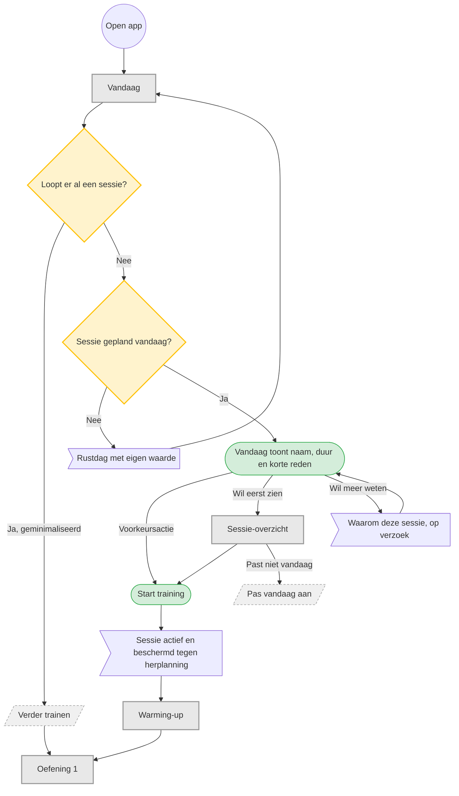

# UC-001 — Sessie van vandaag starten (flowchart)

Herzien: de snelste route staat voorop. Het sessie-overzicht is uitleg, geen verplichte stap.

De warming-up is begeleid maar niet administratief: alleen de warming-upsets zijn afvinkbaar,
en ook dat is optioneel. [T1 p.20; T2 p.3]
