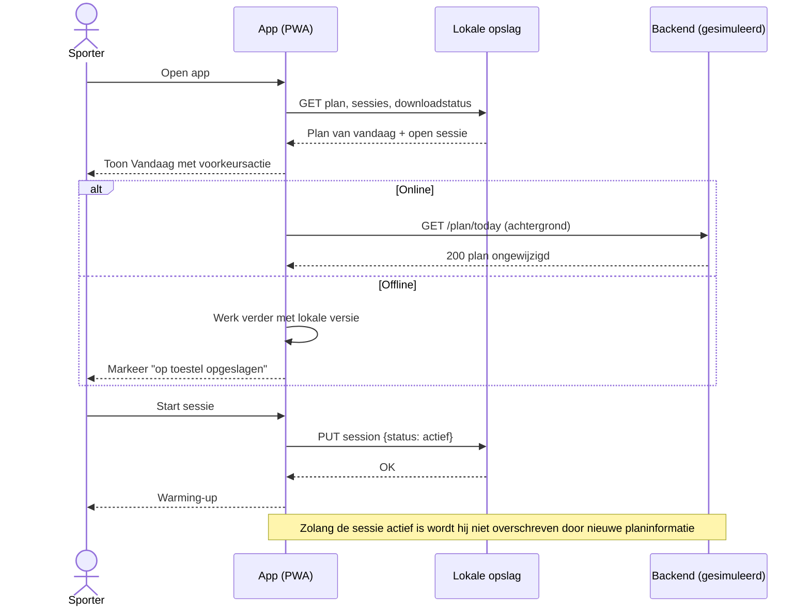

# UC-001 — Sequence (planning en login zijn gesimuleerd in het prototype)

```mermaid
sequenceDiagram
    actor Sporter
    participant App as App (PWA)
    participant Local as Lokale opslag
    participant API as Backend (gesimuleerd)

    Sporter->>App: Open app
    App->>Local: GET plan, sessies, downloadstatus
    Local-->>App: Plan van vandaag + open sessie
    App-->>Sporter: Toon Vandaag met voorkeursactie

    alt Online
        App->>API: GET /plan/today (achtergrond)
        API-->>App: 200 plan ongewijzigd
    else Offline
        App->>App: Werk verder met lokale versie
        App-->>Sporter: Markeer "op toestel opgeslagen"
    end

    Sporter->>App: Start sessie
    App->>Local: PUT session {status: actief}
    Local-->>App: OK
    App-->>Sporter: Warming-up
    Note over App,API: Zolang de sessie actief is wordt hij niet overschreven door nieuwe planinformatie
```
