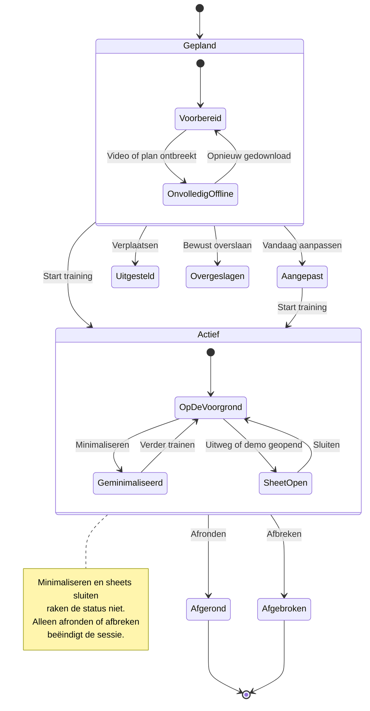

# UC-001 — Toestanden

Herzien: een actieve sessie kan geminimaliseerd zijn zonder onderbroken te zijn.

```mermaid
stateDiagram-v2
    [*] --> Gepland

    state Gepland {
        [*] --> Voorbereid
        Voorbereid --> OnvolledigOffline: Video of plan ontbreekt
        OnvolledigOffline --> Voorbereid: Opnieuw gedownload
    }

    Gepland --> Actief: Start training
    Gepland --> Aangepast: Vandaag aanpassen
    Aangepast --> Actief: Start training

    state Actief {
        [*] --> OpDeVoorgrond
        OpDeVoorgrond --> Geminimaliseerd: Minimaliseren
        Geminimaliseerd --> OpDeVoorgrond: Verder trainen
        OpDeVoorgrond --> SheetOpen: Uitweg of demo geopend
        SheetOpen --> OpDeVoorgrond: Sluiten
    }

    Actief --> Afgerond: Afronden
    Actief --> Afgebroken: Afbreken
    Gepland --> Uitgesteld: Verplaatsen
    Gepland --> Overgeslagen: Bewust overslaan
    Afgerond --> [*]
    Afgebroken --> [*]

    note right of Actief
        Minimaliseren en sheets sluiten
        raken de status niet.
        Alleen afronden of afbreken
        beëindigt de sessie.
    end note
```
