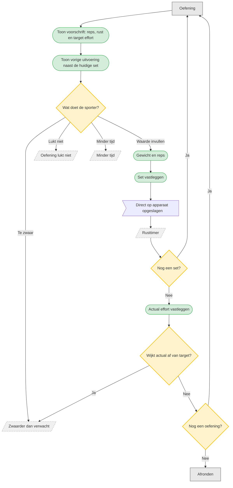

# UC-002 — Set uitvoeren en registreren (flowchart)

Herzien: target effort en actual effort zijn twee verschillende dingen, en de uitwegen zijn
contextueel bereikbaar vanaf de oefening zelf.

**Open in deze fase:** wanneer actual effort wordt gevraagd — na iedere set, alleen bij de laatste
set, of achteraf per oefening. Dat blijft expres onbeslist zodat het visueel te toetsen is.

De demo is geen apart scherm: de video staat groot op het oefenscherm en speelt daar.
Schermvullend kijken doet de speler van het toestel zelf.

Progressie blijft dubbele progressie: eerst reps opbouwen binnen het bereik, daarna gewicht.
Bij vaste reps alleen gewicht. [T1 p.11-12]
