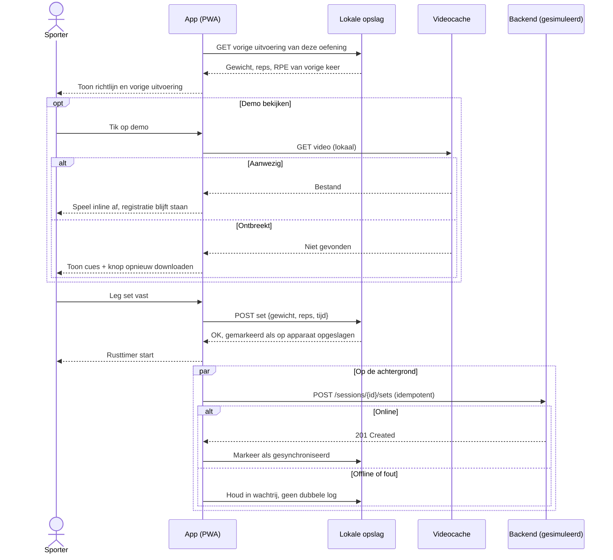

# UC-002 — Sequence

```mermaid
sequenceDiagram
    actor Sporter
    participant App as App (PWA)
    participant Local as Lokale opslag
    participant Media as Videocache
    participant API as Backend (gesimuleerd)

    App->>Local: GET vorige uitvoering van deze oefening
    Local-->>App: Gewicht, reps, RPE van vorige keer
    App-->>Sporter: Toon richtlijn en vorige uitvoering

    opt Demo bekijken
        Sporter->>App: Tik op demo
        App->>Media: GET video (lokaal)
        alt Aanwezig
            Media-->>App: Bestand
            App-->>Sporter: Speel inline af, registratie blijft staan
        else Ontbreekt
            Media-->>App: Niet gevonden
            App-->>Sporter: Toon cues + knop opnieuw downloaden
        end
    end

    Sporter->>App: Leg set vast
    App->>Local: POST set {gewicht, reps, tijd}
    Local-->>App: OK, gemarkeerd als op apparaat opgeslagen
    App-->>Sporter: Rusttimer start

    par Op de achtergrond
        App->>API: POST /sessions/{id}/sets (idempotent)
        alt Online
            API-->>App: 201 Created
            App->>Local: Markeer als gesynchroniseerd
        else Offline of fout
            App->>Local: Houd in wachtrij, geen dubbele log
        end
    end
```
