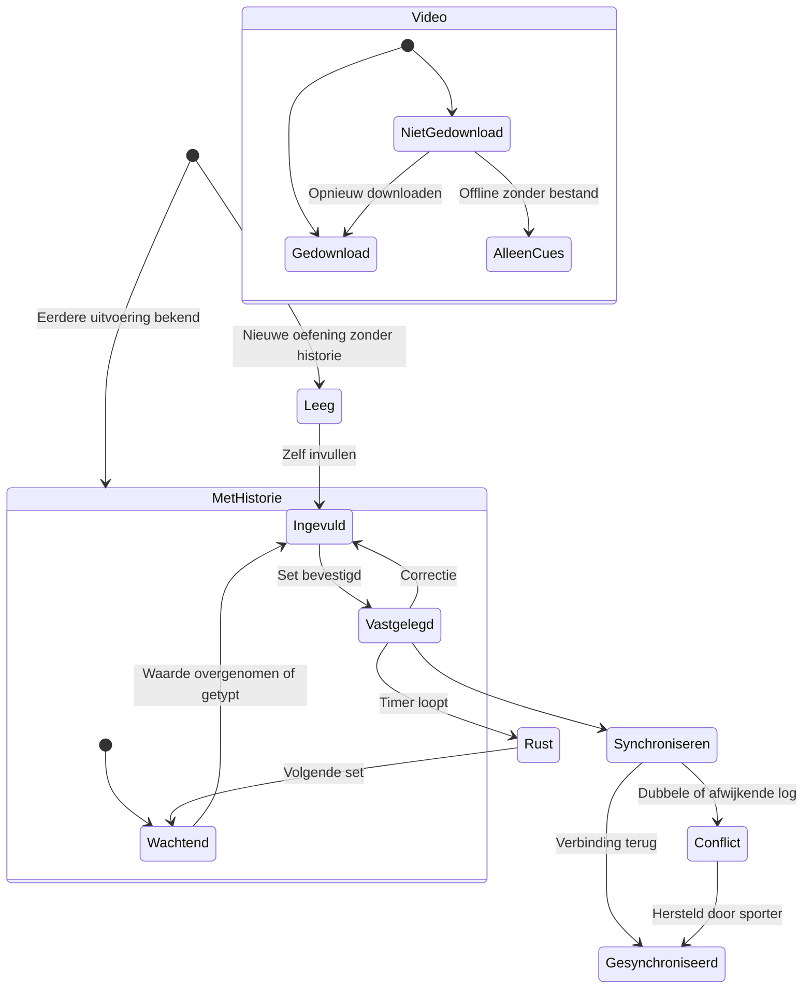

# UC-002 — Toestanden

```mermaid
stateDiagram-v2
    [*] --> Leeg: Nieuwe oefening zonder historie
    [*] --> MetHistorie: Eerdere uitvoering bekend

    state MetHistorie {
        [*] --> Wachtend
        Wachtend --> Ingevuld: Waarde overgenomen of getypt
        Ingevuld --> Vastgelegd: Set bevestigd
        Vastgelegd --> Ingevuld: Correctie
    }

    Leeg --> Ingevuld: Zelf invullen

    Vastgelegd --> Rust: Timer loopt
    Rust --> Wachtend: Volgende set

    state Video {
        [*] --> Gedownload
        [*] --> NietGedownload
        NietGedownload --> Gedownload: Opnieuw downloaden
        NietGedownload --> AlleenCues: Offline zonder bestand
    }

    Vastgelegd --> Synchroniseren
    Synchroniseren --> Gesynchroniseerd: Verbinding terug
    Synchroniseren --> Conflict: Dubbele of afwijkende log
    Conflict --> Gesynchroniseerd: Hersteld door sporter
```
