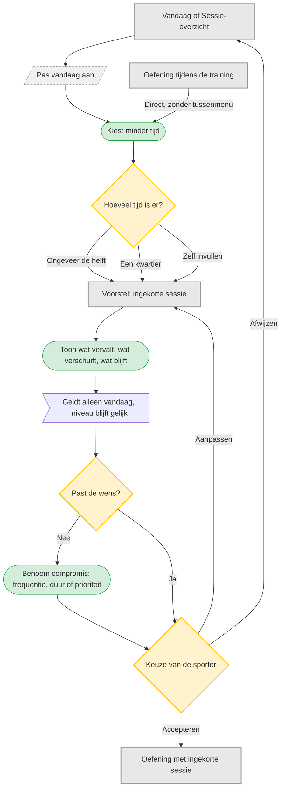

# UC-003 — Minder tijd vandaag (flowchart)

Voor de training is &laquo;Pas vandaag aan&raquo; het verzamelpunt. Tijdens het trainen staat 
Minder tijd direct bij de oefening, zodat niemand eerst door een probleemmenu hoeft.
