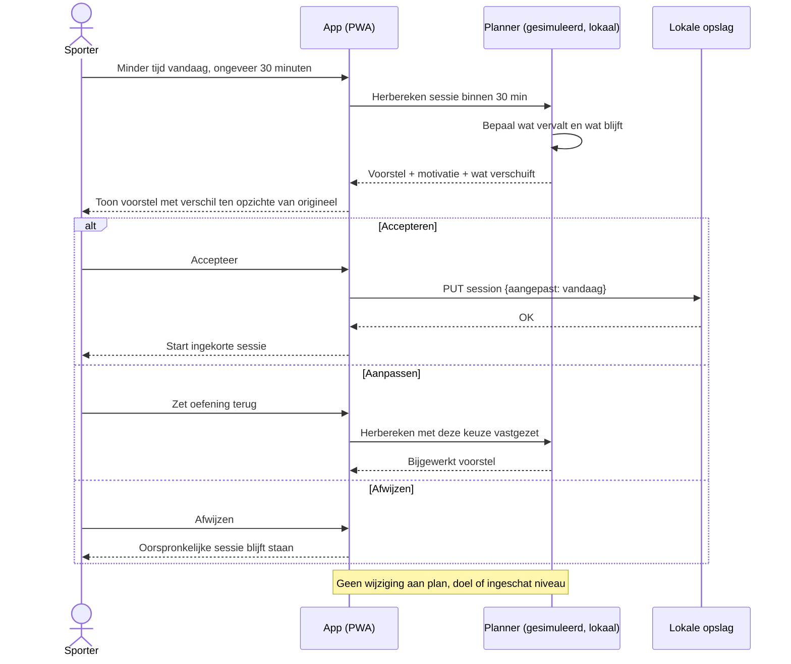

# UC-003 — Sequence

```mermaid
sequenceDiagram
    actor Sporter
    participant App as App (PWA)
    participant Planner as Planner (gesimuleerd, lokaal)
    participant Local as Lokale opslag

    Sporter->>App: Minder tijd vandaag, ongeveer 30 minuten
    App->>Planner: Herbereken sessie binnen 30 min
    Planner->>Planner: Bepaal wat vervalt en wat blijft
    Planner-->>App: Voorstel + motivatie + wat verschuift
    App-->>Sporter: Toon voorstel met verschil ten opzichte van origineel

    alt Accepteren
        Sporter->>App: Accepteer
        App->>Local: PUT session {aangepast: vandaag}
        Local-->>App: OK
        App-->>Sporter: Start ingekorte sessie
    else Aanpassen
        Sporter->>App: Zet oefening terug
        App->>Planner: Herbereken met deze keuze vastgezet
        Planner-->>App: Bijgewerkt voorstel
    else Afwijzen
        Sporter->>App: Afwijzen
        App-->>Sporter: Oorspronkelijke sessie blijft staan
    end

    Note over App,Planner: Geen wijziging aan plan, doel of ingeschat niveau
```
