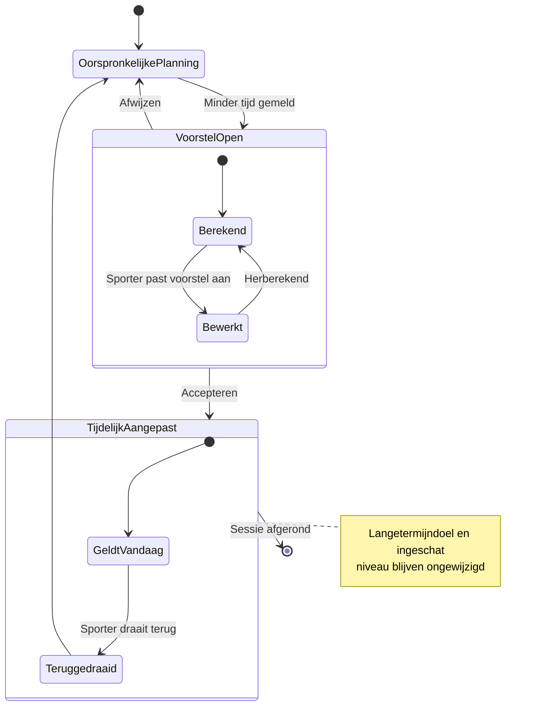

# UC-003 — Toestanden

```mermaid
stateDiagram-v2
    [*] --> OorspronkelijkePlanning

    OorspronkelijkePlanning --> VoorstelOpen: Minder tijd gemeld
    state VoorstelOpen {
        [*] --> Berekend
        Berekend --> Bewerkt: Sporter past voorstel aan
        Bewerkt --> Berekend: Herberekend
    }

    VoorstelOpen --> TijdelijkAangepast: Accepteren
    VoorstelOpen --> OorspronkelijkePlanning: Afwijzen

    state TijdelijkAangepast {
        [*] --> GeldtVandaag
        GeldtVandaag --> Teruggedraaid: Sporter draait terug
    }

    Teruggedraaid --> OorspronkelijkePlanning
    TijdelijkAangepast --> [*]: Sessie afgerond

    note right of TijdelijkAangepast
        Langetermijndoel en ingeschat
        niveau blijven ongewijzigd
    end note
```
