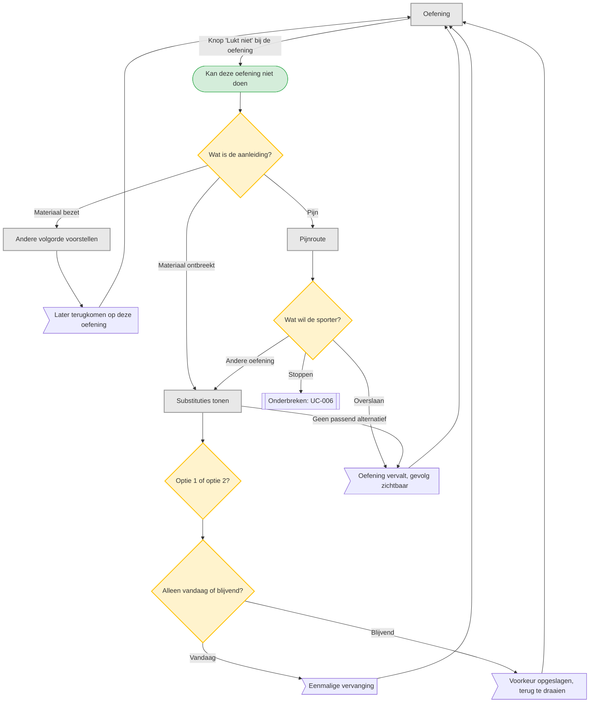

# UC-004 — Oefening niet mogelijk (flowchart)

De app stelt geen diagnose. Pijn leidt tot overslaan of stoppen, nooit tot een oordeel over
de sporter of een automatische verlaging van het niveau. [Brief p.2; T1 p.27]

Dit is een sheet over de oefening: sluiten brengt je terug bij de set, zonder dat er
iets aan de sessie verandert.
