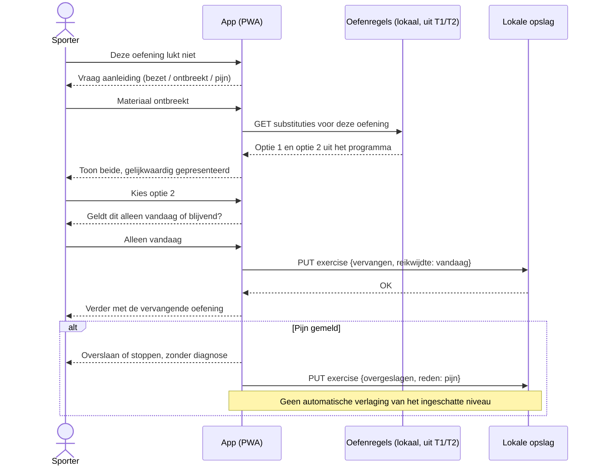

# UC-004 — Sequence

```mermaid
sequenceDiagram
    actor Sporter
    participant App as App (PWA)
    participant Rules as Oefenregels (lokaal, uit T1/T2)
    participant Local as Lokale opslag

    Sporter->>App: Deze oefening lukt niet
    App-->>Sporter: Vraag aanleiding (bezet / ontbreekt / pijn)
    Sporter->>App: Materiaal ontbreekt
    App->>Rules: GET substituties voor deze oefening
    Rules-->>App: Optie 1 en optie 2 uit het programma
    App-->>Sporter: Toon beide, gelijkwaardig gepresenteerd

    Sporter->>App: Kies optie 2
    App-->>Sporter: Geldt dit alleen vandaag of blijvend?
    Sporter->>App: Alleen vandaag
    App->>Local: PUT exercise {vervangen, reikwijdte: vandaag}
    Local-->>App: OK
    App-->>Sporter: Verder met de vervangende oefening

    alt Pijn gemeld
        App-->>Sporter: Overslaan of stoppen, zonder diagnose
        App->>Local: PUT exercise {overgeslagen, reden: pijn}
        Note over App,Local: Geen automatische verlaging van het ingeschatte niveau
    end
```
