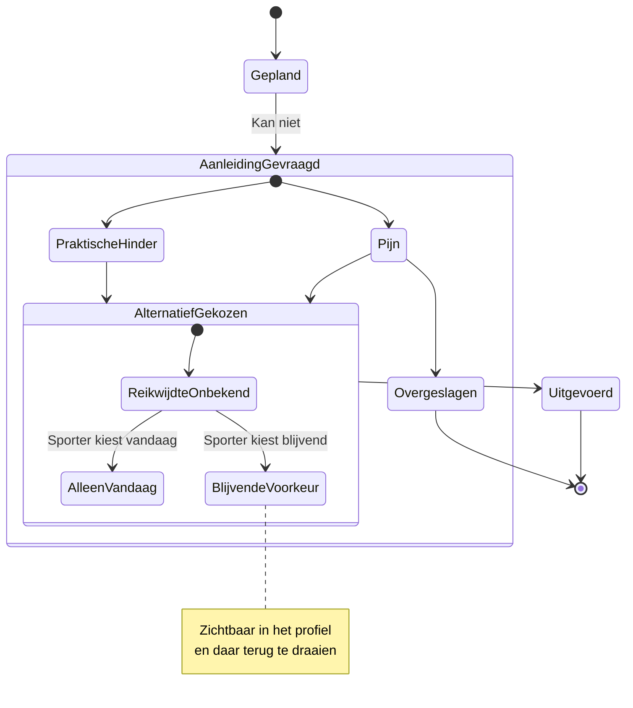

# UC-004 — Toestanden

```mermaid
stateDiagram-v2
    [*] --> Gepland

    Gepland --> AanleidingGevraagd: Kan niet
    state AanleidingGevraagd {
        [*] --> PraktischeHinder
        [*] --> Pijn
        PraktischeHinder --> AlternatiefGekozen
        Pijn --> Overgeslagen
        Pijn --> AlternatiefGekozen
    }

    state AlternatiefGekozen {
        [*] --> ReikwijdteOnbekend
        ReikwijdteOnbekend --> AlleenVandaag: Sporter kiest vandaag
        ReikwijdteOnbekend --> BlijvendeVoorkeur: Sporter kiest blijvend
    }

    AlternatiefGekozen --> Uitgevoerd
    Overgeslagen --> [*]
    Uitgevoerd --> [*]

    note right of BlijvendeVoorkeur
        Zichtbaar in het profiel
        en daar terug te draaien
    end note
```
