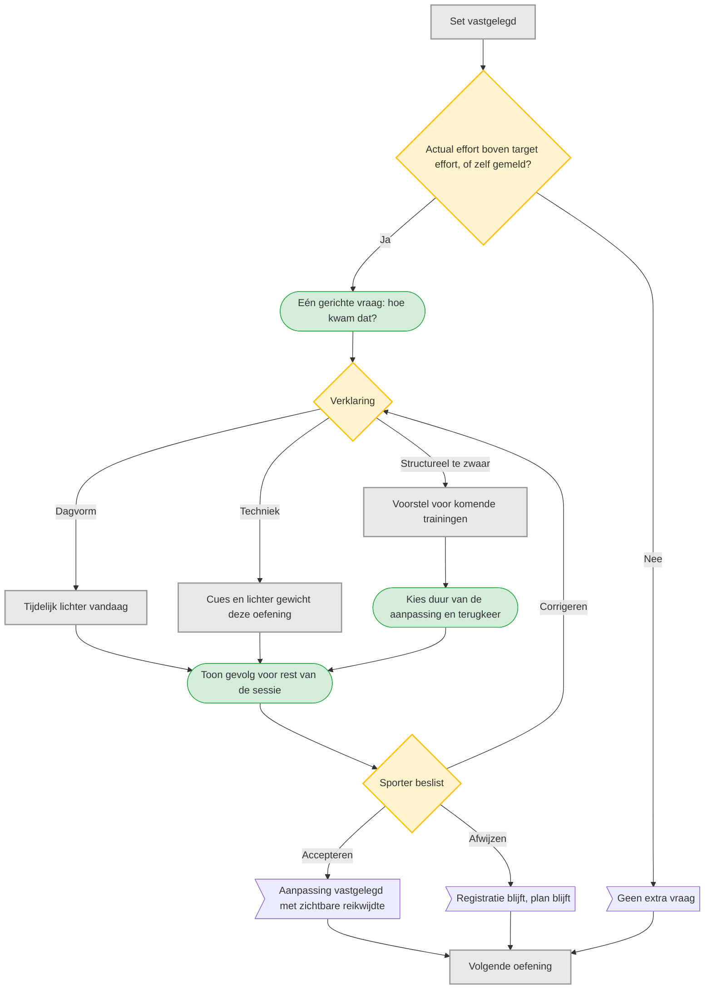

# UC-005 — Zwaarder dan verwacht (flowchart)

Bereikbaar via de knop 'Te zwaar' bij de oefening zelf, als sheet.
Alleen doorvragen wanneer het antwoord de vervolgstap verandert. Een slechte dag mag het
langetermijndoel niet ongemerkt wijzigen. [B p.7 en p.19, principe 6]
