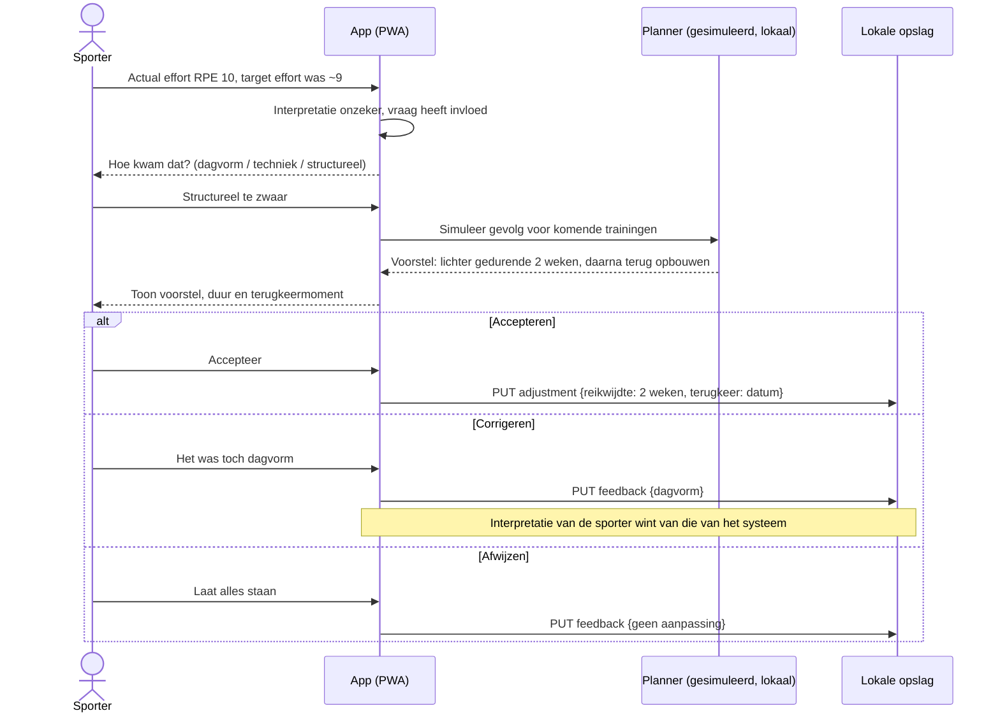

# UC-005 — Sequence

```mermaid
sequenceDiagram
    actor Sporter
    participant App as App (PWA)
    participant Planner as Planner (gesimuleerd, lokaal)
    participant Local as Lokale opslag

    Sporter->>App: Actual effort RPE 10, target effort was ~9
    App->>App: Interpretatie onzeker, vraag heeft invloed
    App-->>Sporter: Hoe kwam dat? (dagvorm / techniek / structureel)

    Sporter->>App: Structureel te zwaar
    App->>Planner: Simuleer gevolg voor komende trainingen
    Planner-->>App: Voorstel: lichter gedurende 2 weken, daarna terug opbouwen
    App-->>Sporter: Toon voorstel, duur en terugkeermoment

    alt Accepteren
        Sporter->>App: Accepteer
        App->>Local: PUT adjustment {reikwijdte: 2 weken, terugkeer: datum}
    else Corrigeren
        Sporter->>App: Het was toch dagvorm
        App->>Local: PUT feedback {dagvorm}
        Note over App,Local: Interpretatie van de sporter wint van die van het systeem
    else Afwijzen
        Sporter->>App: Laat alles staan
        App->>Local: PUT feedback {geen aanpassing}
    end
```
