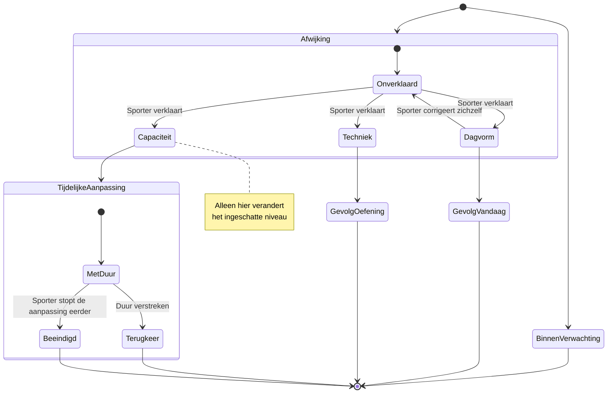

# UC-005 — Toestanden

```mermaid
stateDiagram-v2
    [*] --> BinnenVerwachting
    BinnenVerwachting --> [*]

    [*] --> Afwijking
    state Afwijking {
        [*] --> Onverklaard
        Onverklaard --> Dagvorm: Sporter verklaart
        Onverklaard --> Techniek: Sporter verklaart
        Onverklaard --> Capaciteit: Sporter verklaart
        Dagvorm --> Onverklaard: Sporter corrigeert zichzelf
    }

    Dagvorm --> GevolgVandaag
    Techniek --> GevolgOefening
    Capaciteit --> TijdelijkeAanpassing

    state TijdelijkeAanpassing {
        [*] --> MetDuur
        MetDuur --> Terugkeer: Duur verstreken
        MetDuur --> Beeindigd: Sporter stopt de aanpassing eerder
    }

    GevolgVandaag --> [*]
    GevolgOefening --> [*]
    Terugkeer --> [*]
    Beeindigd --> [*]

    note right of Capaciteit
        Alleen hier verandert
        het ingeschatte niveau
    end note
```
