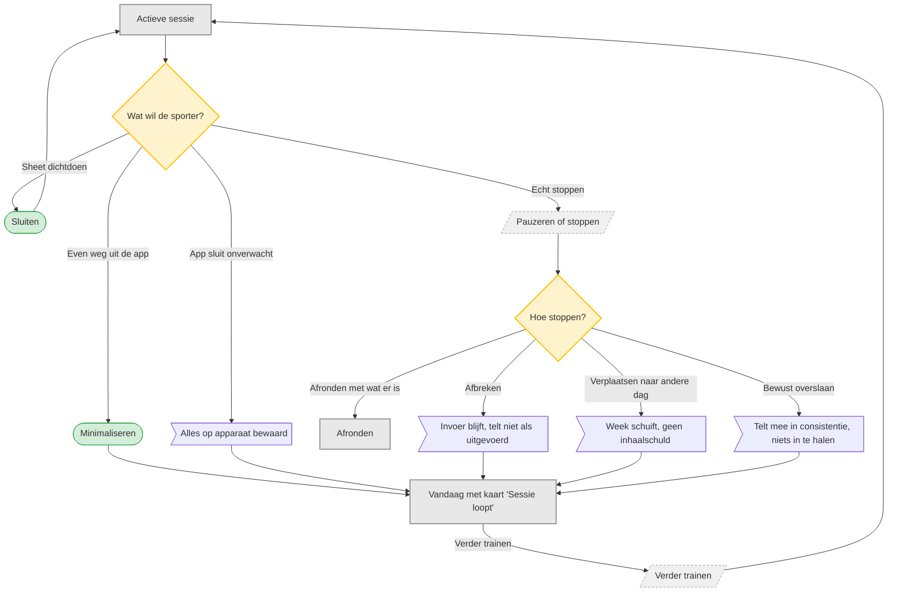

# UC-006 — Pauzeren, stoppen of overslaan (flowchart)

Herzien: minimaliseren, be&euml;indigen en een sheet sluiten zijn drie verschillende dingen.

Alleen de takken onder &laquo;Echt stoppen&raquo; veranderen de status van de sessie.
[B p.19, principe 4]
