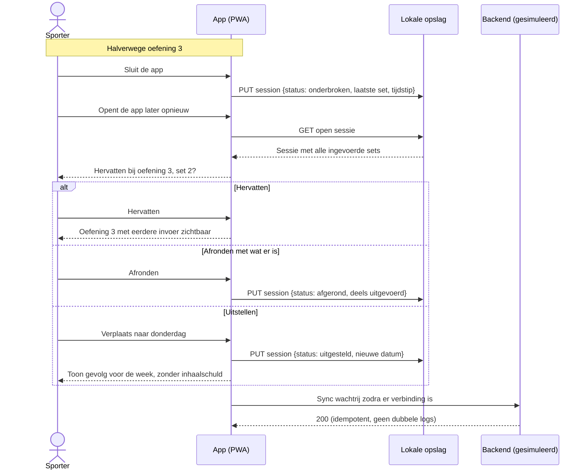

# UC-006 — Sequence

```mermaid
sequenceDiagram
    actor Sporter
    participant App as App (PWA)
    participant Local as Lokale opslag
    participant API as Backend (gesimuleerd)

    Note over Sporter,App: Halverwege oefening 3
    Sporter->>App: Sluit de app
    App->>Local: PUT session {status: onderbroken, laatste set, tijdstip}

    Sporter->>App: Opent de app later opnieuw
    App->>Local: GET open sessie
    Local-->>App: Sessie met alle ingevoerde sets
    App-->>Sporter: Hervatten bij oefening 3, set 2?

    alt Hervatten
        Sporter->>App: Hervatten
        App-->>Sporter: Oefening 3 met eerdere invoer zichtbaar
    else Afronden met wat er is
        Sporter->>App: Afronden
        App->>Local: PUT session {status: afgerond, deels uitgevoerd}
    else Uitstellen
        Sporter->>App: Verplaats naar donderdag
        App->>Local: PUT session {status: uitgesteld, nieuwe datum}
        App-->>Sporter: Toon gevolg voor de week, zonder inhaalschuld
    end

    App->>API: Sync wachtrij zodra er verbinding is
    API-->>App: 200 (idempotent, geen dubbele logs)
```
