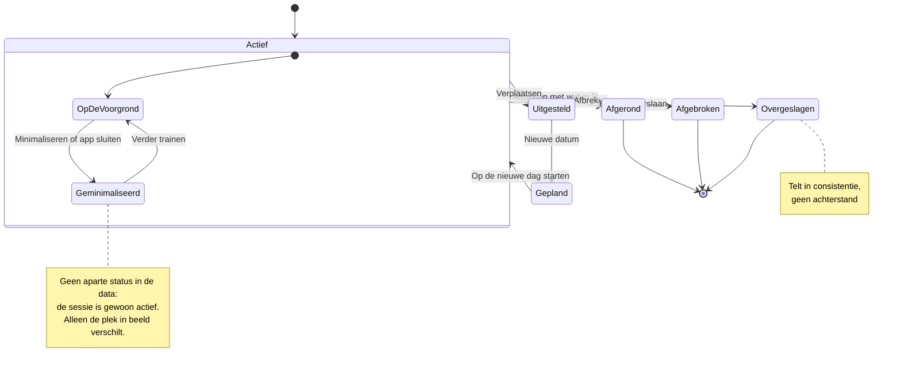

# UC-006 — Toestanden

```mermaid
stateDiagram-v2
    [*] --> Actief

    state Actief {
        [*] --> OpDeVoorgrond
        OpDeVoorgrond --> Geminimaliseerd: Minimaliseren of app sluiten
        Geminimaliseerd --> OpDeVoorgrond: Verder trainen
    }

    Actief --> Afgerond: Afronden met wat er is
    Actief --> Afgebroken: Afbreken
    Actief --> Uitgesteld: Verplaatsen
    Actief --> Overgeslagen: Bewust overslaan

    Uitgesteld --> Gepland: Nieuwe datum
    Gepland --> Actief: Op de nieuwe dag starten

    Afgerond --> [*]
    Afgebroken --> [*]
    Overgeslagen --> [*]

    note right of Geminimaliseerd
        Geen aparte status in de data:
        de sessie is gewoon actief.
        Alleen de plek in beeld verschilt.
    end note

    note right of Overgeslagen
        Telt in consistentie,
        geen achterstand
    end note
```
