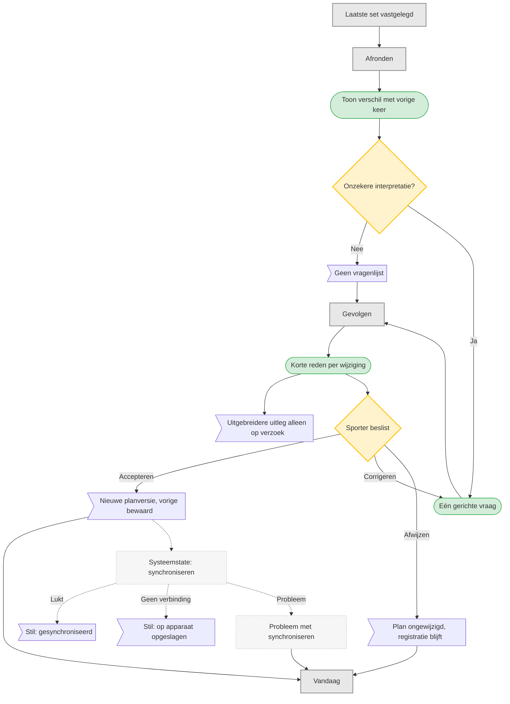

# UC-007 — Sessie afronden en feedback (flowchart)

Herzien: synchronisatie loopt op de achtergrond. Alleen een echt probleem onderbreekt.

De drie stille statussen (op apparaat opgeslagen, synchroniseren, gesynchroniseerd) staan klein in
beeld en vragen niets. Alleen &laquo;probleem met synchroniseren&raquo; is een bestemming.
