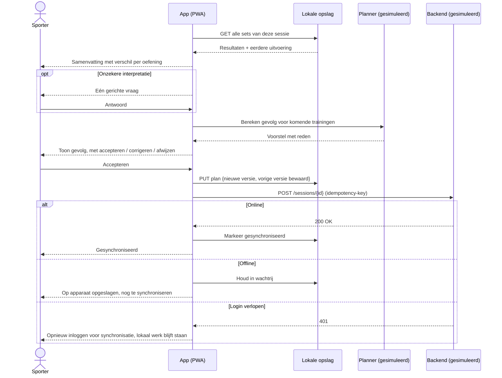

# UC-007 — Sequence

```mermaid
sequenceDiagram
    actor Sporter
    participant App as App (PWA)
    participant Local as Lokale opslag
    participant Planner as Planner (gesimuleerd)
    participant API as Backend (gesimuleerd)

    App->>Local: GET alle sets van deze sessie
    Local-->>App: Resultaten + eerdere uitvoering
    App-->>Sporter: Samenvatting met verschil per oefening

    opt Onzekere interpretatie
        App-->>Sporter: Eén gerichte vraag
        Sporter->>App: Antwoord
    end

    App->>Planner: Bereken gevolg voor komende trainingen
    Planner-->>App: Voorstel met reden
    App-->>Sporter: Toon gevolg, met accepteren / corrigeren / afwijzen
    Sporter->>App: Accepteren
    App->>Local: PUT plan {nieuwe versie, vorige versie bewaard}

    App->>API: POST /sessions/{id} (idempotency-key)
    alt Online
        API-->>App: 200 OK
        App->>Local: Markeer gesynchroniseerd
        App-->>Sporter: Gesynchroniseerd
    else Offline
        App->>Local: Houd in wachtrij
        App-->>Sporter: Op apparaat opgeslagen, nog te synchroniseren
    else Login verlopen
        API-->>App: 401
        App-->>Sporter: Opnieuw inloggen voor synchronisatie, lokaal werk blijft staan
    end
```
