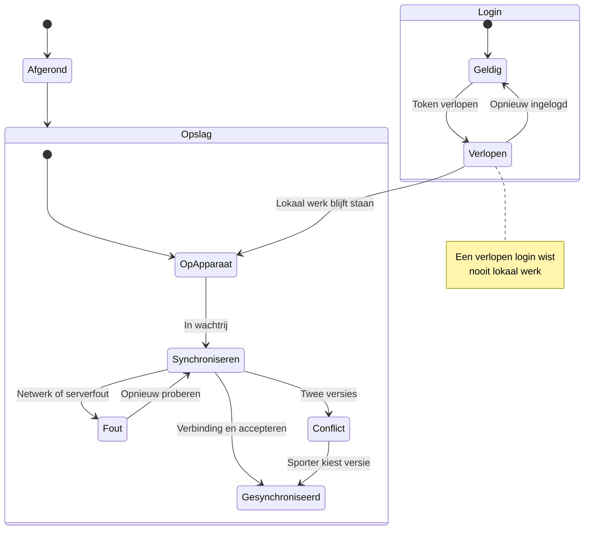

# UC-007 — Toestanden

```mermaid
stateDiagram-v2
    [*] --> Afgerond

    state Opslag {
        [*] --> OpApparaat
        OpApparaat --> Synchroniseren: In wachtrij
        Synchroniseren --> Gesynchroniseerd: Verbinding en accepteren
        Synchroniseren --> Fout: Netwerk of serverfout
        Fout --> Synchroniseren: Opnieuw proberen
        Synchroniseren --> Conflict: Twee versies
        Conflict --> Gesynchroniseerd: Sporter kiest versie
    }

    state Login {
        [*] --> Geldig
        Geldig --> Verlopen: Token verlopen
        Verlopen --> Geldig: Opnieuw ingelogd
    }

    Afgerond --> Opslag
    Verlopen --> OpApparaat: Lokaal werk blijft staan

    note right of Verlopen
        Een verlopen login wist
        nooit lokaal werk
    end note
```
