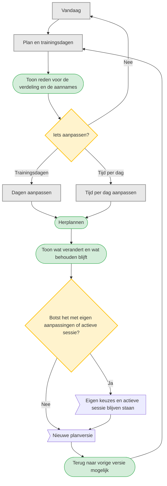

# UC-008 — Plan en trainingsdagen bijstellen (flowchart, dunne rand)

```mermaid
graph TD
    Today[Vandaag] --> Plan[Plan en trainingsdagen]
    Plan --> Why([Toon reden voor de verdeling en de aannames])
    Why --> Edit{Iets aanpassen?}
    Edit -->|Nee| Today
    Edit -->|Trainingsdagen| Days[Dagen aanpassen]
    Edit -->|Tijd per dag| Time[Tijd per dag aanpassen]
    Days --> Replan([Herplannen])
    Time --> Replan
    Replan --> Show([Toon wat verandert en wat behouden blijft])
    Show --> Conflict{Botst het met eigen aanpassingen of actieve sessie?}
    Conflict -->|Ja| Protect>Eigen keuzes en actieve sessie blijven staan]
    Conflict -->|Nee| Apply>Nieuwe planversie]
    Protect --> Apply
    Apply --> Undo([Terug naar vorige versie mogelijk])
    Undo --> Plan

    classDef screen fill:#e8e8e8,stroke:#999,stroke-width:2px
    classDef decision fill:#fff3cd,stroke:#ffc107,stroke-width:2px
    classDef action fill:#d4edda,stroke:#28a745,stroke-width:1px
    class Today,Plan,Days,Time screen
    class Edit,Conflict decision
    class Why,Replan,Show,Undo action
```
