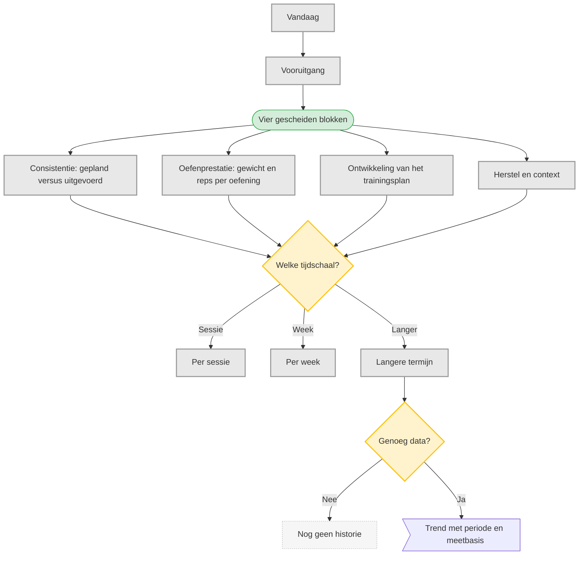

# UC-009 — Vooruitgang bekijken (flowchart, dunne rand)

Herzien: vier betekenissen, en geen samengestelde doelontwikkeling.

**Ontwikkeling van het trainingsplan** gaat over waar het programma staat: repbereiken,
gewichtsverhogingen, blijvende vervangingen, blok en week. Dat is iets anders dan wat het lichaam
doet. Lichaamsgewicht staat onder herstel en context, expliciet als context en niet als meting van
spiergroei of vetverlies. De bronnen onderbouwen zo'n afleiding niet. [Brief p.3; B p.19, principe 7]
