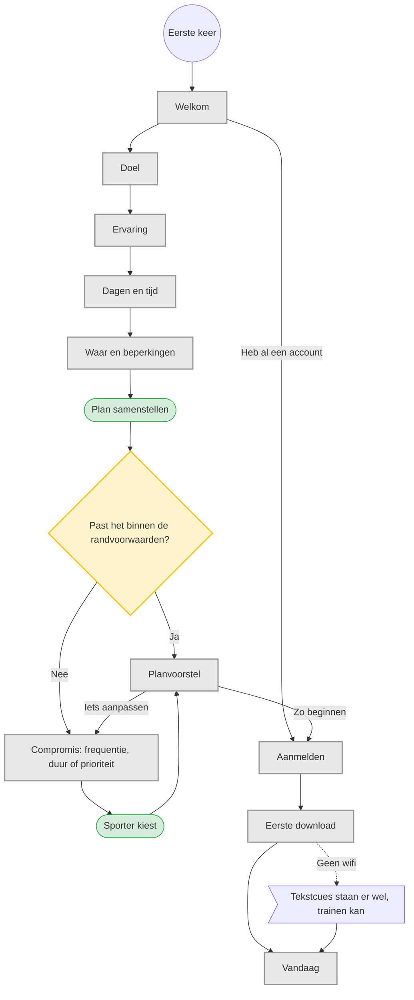

# UC-010 — Onboarding en eerste plan (flowchart)

Vier vragen, niet meer. Gewichten worden bewust niet gevraagd: die leert de app tijdens de eerste
sessie kennen. Dat volgt het uitgangspunt uit de brief om later extra gegevens te verzamelen
wanneer die een beslissing verbeteren. [Brief p.1]
