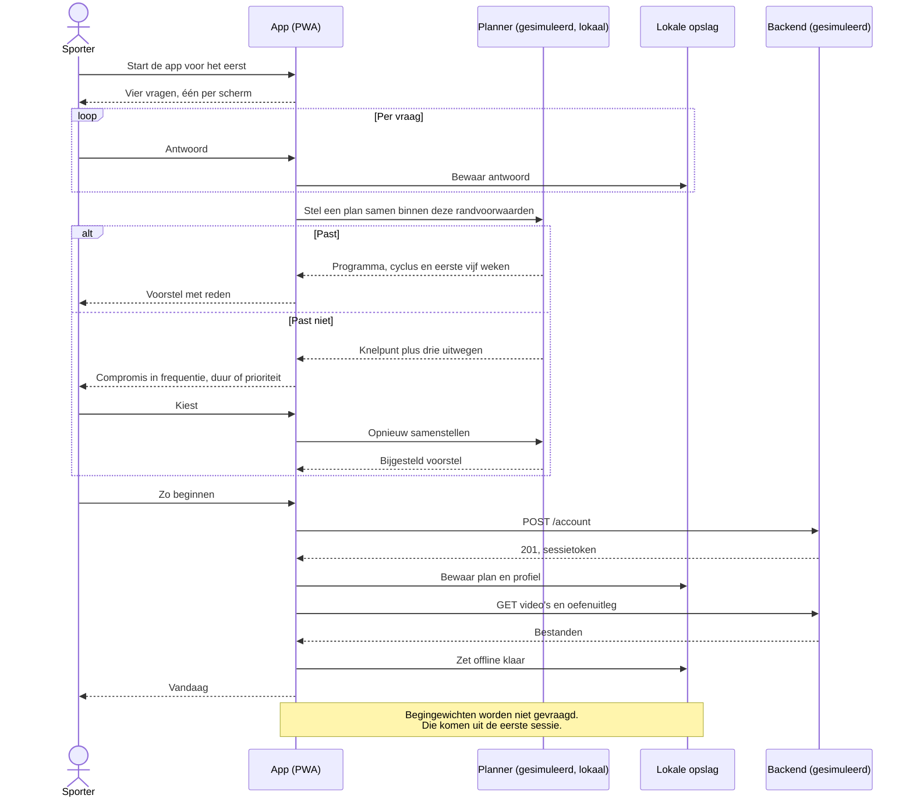

# UC-010 — Sequence (planning en account zijn gesimuleerd in het prototype)

```mermaid
sequenceDiagram
    actor Sporter
    participant App as App (PWA)
    participant Planner as Planner (gesimuleerd, lokaal)
    participant Local as Lokale opslag
    participant API as Backend (gesimuleerd)

    Sporter->>App: Start de app voor het eerst
    App-->>Sporter: Vier vragen, één per scherm

    loop Per vraag
        Sporter->>App: Antwoord
        App->>Local: Bewaar antwoord
    end

    App->>Planner: Stel een plan samen binnen deze randvoorwaarden
    alt Past
        Planner-->>App: Programma, cyclus en eerste vijf weken
        App-->>Sporter: Voorstel met reden
    else Past niet
        Planner-->>App: Knelpunt plus drie uitwegen
        App-->>Sporter: Compromis in frequentie, duur of prioriteit
        Sporter->>App: Kiest
        App->>Planner: Opnieuw samenstellen
        Planner-->>App: Bijgesteld voorstel
    end

    Sporter->>App: Zo beginnen
    App->>API: POST /account
    API-->>App: 201, sessietoken
    App->>Local: Bewaar plan en profiel
    App->>API: GET video's en oefenuitleg
    API-->>App: Bestanden
    App->>Local: Zet offline klaar
    App-->>Sporter: Vandaag

    Note over App,Local: Begingewichten worden niet gevraagd.<br/>Die komen uit de eerste sessie.
```
