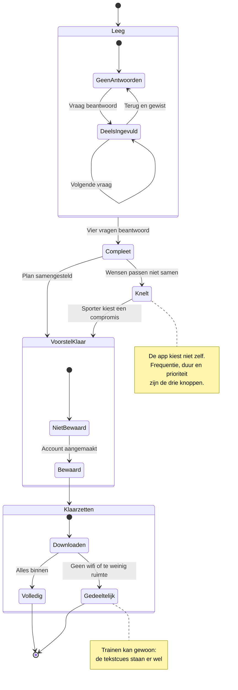

# UC-010 — Toestanden

```mermaid
stateDiagram-v2
    [*] --> Leeg

    state Leeg {
        [*] --> GeenAntwoorden
        GeenAntwoorden --> DeelsIngevuld: Vraag beantwoord
        DeelsIngevuld --> DeelsIngevuld: Volgende vraag
        DeelsIngevuld --> GeenAntwoorden: Terug en gewist
    }

    Leeg --> Compleet: Vier vragen beantwoord
    Compleet --> VoorstelKlaar: Plan samengesteld
    Compleet --> Knelt: Wensen passen niet samen
    Knelt --> VoorstelKlaar: Sporter kiest een compromis

    state VoorstelKlaar {
        [*] --> NietBewaard
        NietBewaard --> Bewaard: Account aangemaakt
    }

    Bewaard --> Klaarzetten
    state Klaarzetten {
        [*] --> Downloaden
        Downloaden --> Volledig: Alles binnen
        Downloaden --> Gedeeltelijk: Geen wifi of te weinig ruimte
    }

    Volledig --> [*]
    Gedeeltelijk --> [*]

    note right of Gedeeltelijk
        Trainen kan gewoon:
        de tekstcues staan er wel
    end note

    note right of Knelt
        De app kiest niet zelf.
        Frequentie, duur en prioriteit
        zijn de drie knoppen.
    end note
```
