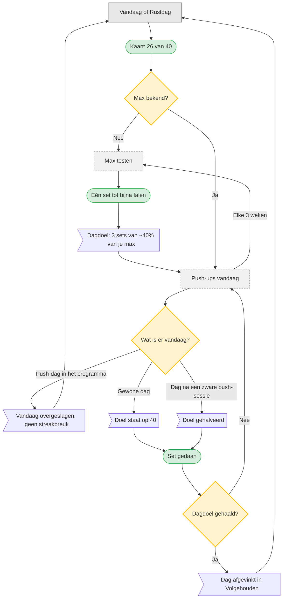

# UC-011 — Dagelijkse push-ups (flowchart)

Het dagdoel deelt belasting met het programma: op een Push-dag slaat de app de push-ups over, de
dag erna halveert hij ze. Dat is wat de brief vraagt over het bewaken van volgorde, herstel en
totale belasting, ook over weekgrenzen. [Brief p.1]

Het is nadrukkelijk **geen** gedeelde sturing: de app claimt niet dat push-ups en het
krachtprogramma samen naar één uitkomst gestuurd worden. De benchmark laat zien dat samen
aanbieden iets anders is dan samen plannen, en dat weer iets anders dan samen sturen. [B p.17]
