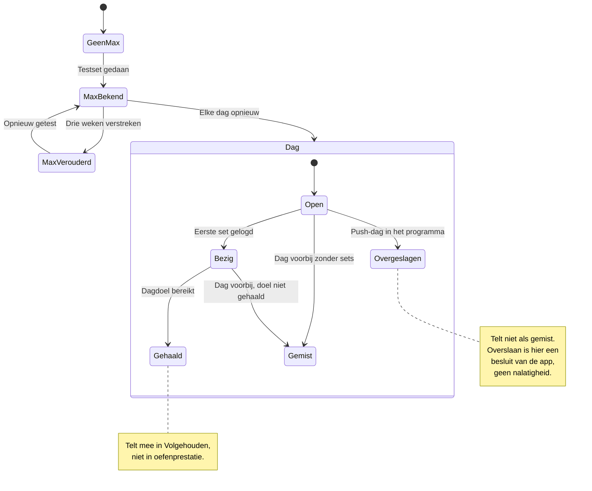

# UC-011 — Toestanden

```mermaid
stateDiagram-v2
    [*] --> GeenMax

    GeenMax --> MaxBekend: Testset gedaan
    MaxBekend --> MaxVerouderd: Drie weken verstreken
    MaxVerouderd --> MaxBekend: Opnieuw getest

    state Dag {
        [*] --> Open
        Open --> Bezig: Eerste set gelogd
        Bezig --> Gehaald: Dagdoel bereikt
        Open --> Overgeslagen: Push-dag in het programma
        Open --> Gemist: Dag voorbij zonder sets
        Bezig --> Gemist: Dag voorbij, doel niet gehaald
    }

    MaxBekend --> Dag: Elke dag opnieuw

    note right of Overgeslagen
        Telt niet als gemist.
        Overslaan is hier een
        besluit van de app,
        geen nalatigheid.
    end note

    note right of Gehaald
        Telt mee in Volgehouden,
        niet in oefenprestatie.
    end note
```
