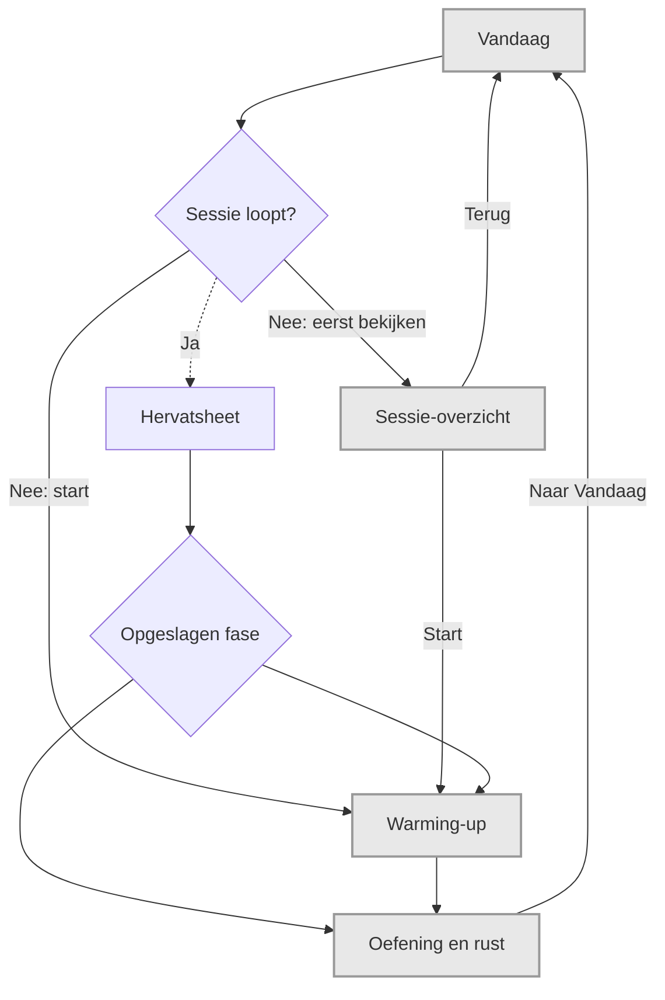

# UC-001 - Vandaag en sessie

```mermaid
flowchart TD
    Today[Vandaag] --> Choice{Sessie loopt?}
    Choice -->|Nee: start| Warmup[Warming-up]
    Choice -->|Nee: eerst bekijken| Overview[Sessie-overzicht]
    Overview -->|Terug| Today
    Overview -->|Start| Warmup
    Choice -.->|Ja| Resume[Hervatsheet]
    Resume --> Phase{Opgeslagen fase}
    Phase --> Warmup
    Phase --> Exercise[Oefening en rust]
    Warmup --> Exercise
    Exercise -->|Naar Vandaag| Today
    classDef screen fill:#e8e8e8,stroke:#999,stroke-width:2px
    class Today,Overview,Warmup,Exercise screen
```
