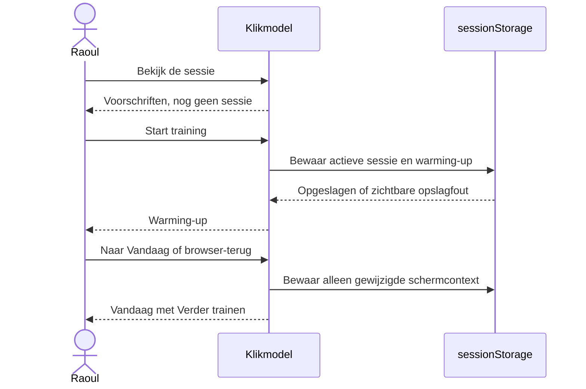

# UC-001 - Lokale uitvoering

```mermaid
sequenceDiagram
    actor Raoul
    participant App as Klikmodel
    participant Store as sessionStorage
    Raoul->>App: Bekijk de sessie
    App-->>Raoul: Voorschriften, nog geen sessie
    Raoul->>App: Start training
    App->>Store: Bewaar actieve sessie en warming-up
    Store-->>App: Opgeslagen of zichtbare opslagfout
    App-->>Raoul: Warming-up
    Raoul->>App: Naar Vandaag of browser-terug
    App->>Store: Bewaar alleen gewijzigde schermcontext
    App-->>Raoul: Vandaag met Verder trainen
```

Geen backend of HTTP-mutaties in het klikmodel; M1 IndexedDB blijft onaangeraakt.
