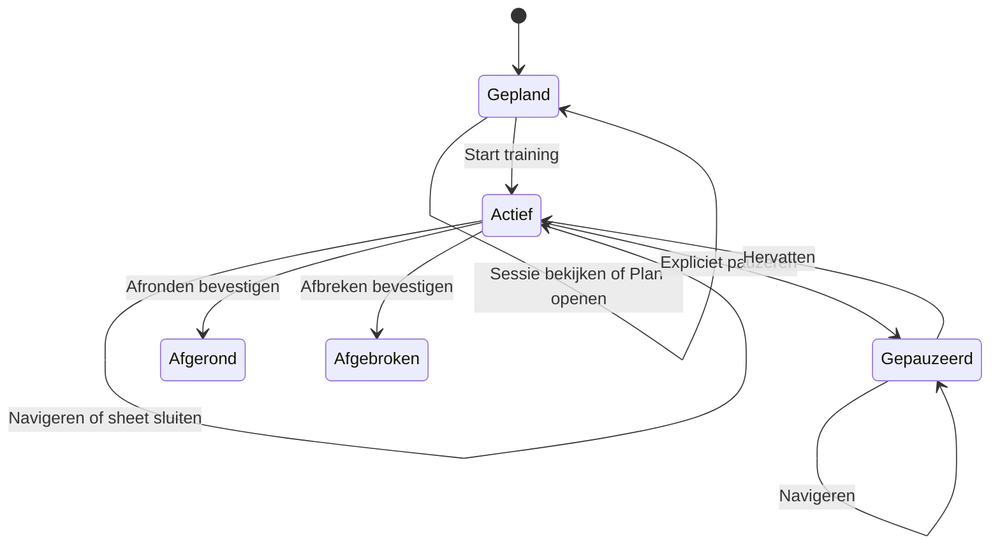

# UC-001 - Sessiestatus staat los van navigatie

```mermaid
stateDiagram-v2
    [*] --> Gepland
    Gepland --> Gepland: Sessie bekijken of Plan openen
    Gepland --> Actief: Start training
    Actief --> Actief: Navigeren of sheet sluiten
    Actief --> Gepauzeerd: Expliciet pauzeren
    Gepauzeerd --> Gepauzeerd: Navigeren
    Gepauzeerd --> Actief: Hervatten
    Actief --> Afgerond: Afronden bevestigen
    Actief --> Afgebroken: Afbreken bevestigen
```
