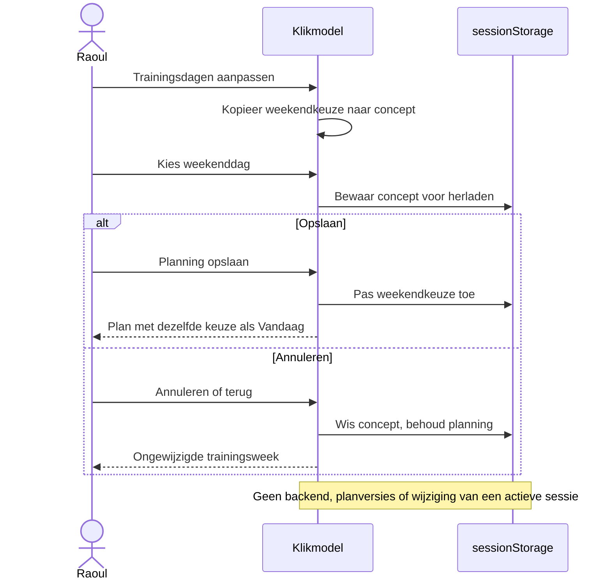

# UC-008 - Eerst concept, dan toepassen

```mermaid
sequenceDiagram
    actor Raoul
    participant App as Klikmodel
    participant Store as sessionStorage
    Raoul->>App: Trainingsdagen aanpassen
    App->>App: Kopieer weekendkeuze naar concept
    Raoul->>App: Kies weekenddag
    App->>Store: Bewaar concept voor herladen
    alt Opslaan
        Raoul->>App: Planning opslaan
        App->>Store: Pas weekendkeuze toe
        App-->>Raoul: Plan met dezelfde keuze als Vandaag
    else Annuleren
        Raoul->>App: Annuleren of terug
        App->>Store: Wis concept, behoud planning
        App-->>Raoul: Ongewijzigde trainingsweek
    end
    Note over App,Store: Geen backend, planversies of wijziging van een actieve sessie
```
