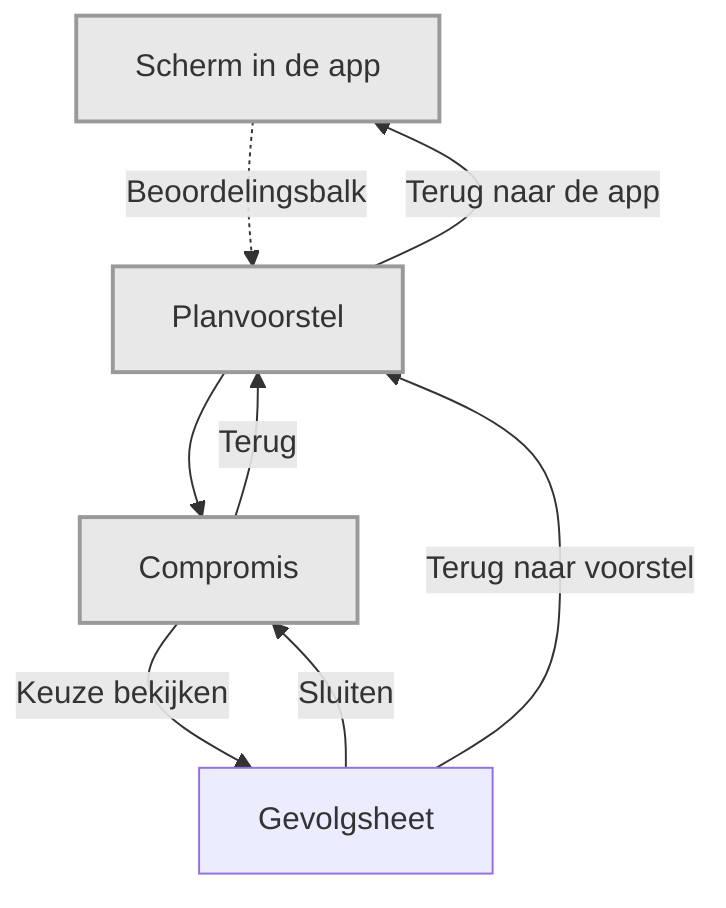

# UC-010 - Beoordeling buiten dagelijkse navigatie

```mermaid
flowchart TD
    Origin[Scherm in de app] -.->|Beoordelingsbalk| Proposal[Planvoorstel]
    Proposal --> Compromise[Compromis]
    Compromise -->|Keuze bekijken| Result[Gevolgsheet]
    Result -->|Sluiten| Compromise
    Result -->|Terug naar voorstel| Proposal
    Compromise -->|Terug| Proposal
    Proposal -->|Terug naar de app| Origin
    classDef screen fill:#e8e8e8,stroke:#999,stroke-width:2px
    class Origin,Proposal,Compromise screen
```
