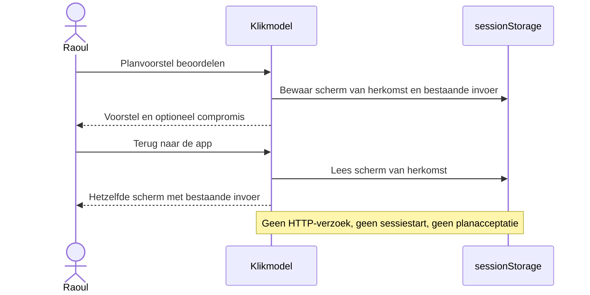

# UC-010 - Context bewaren

```mermaid
sequenceDiagram
    actor Raoul
    participant App as Klikmodel
    participant Store as sessionStorage
    Raoul->>App: Planvoorstel beoordelen
    App->>Store: Bewaar scherm van herkomst en bestaande invoer
    App-->>Raoul: Voorstel en optioneel compromis
    Raoul->>App: Terug naar de app
    App->>Store: Lees scherm van herkomst
    App-->>Raoul: Hetzelfde scherm met bestaande invoer
    Note over App,Store: Geen HTTP-verzoek, geen sessiestart, geen planacceptatie
```
