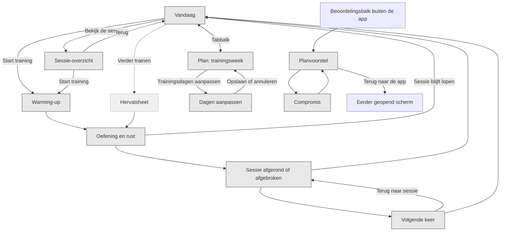

# M2 - schermrollen en navigatie

Deze gerichte kaart vervangt de gemengde navigatie in het M2-klikmodel. De volledige productkaart
blijft [../diagrams/screen-map.md](../diagrams/screen-map.md); PPL-voorbeeldinhoud blijft daar referentie.

Hervatten keert terug naar de opgeslagen fase; dat kan ook warming-up zijn. Rust blijft een
substate bij de oefening. Sheets sluiten laat het scherm eronder staan. De tabbalk is alleen op
Vandaag en Plan zichtbaar. Beide zijn hoofdbestemmingen en hebben geen kunstmatige terugknop.
Plan biedt geen duplicaat van de sessielijst en geen ingang naar onboarding.

Het klikmodel toont een woensdagvoorbeeld, geen kalendergestuurde planner. De weekendkeuze
plant geen tweede uitvoerbare sessie in dit model; dat blijft werk voor de echte M2/planning.
