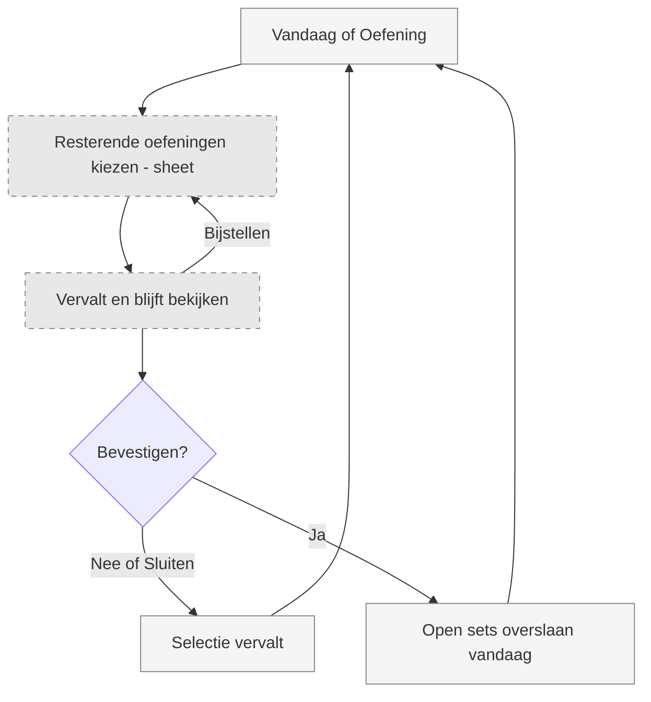

# UC-003 - Minder tijd

```mermaid
flowchart TD
  A[Vandaag of Oefening] --> B[Resterende oefeningen kiezen - sheet]
  B --> C[Vervalt en blijft bekijken]
  C --> D{Bevestigen?}
  D -->|Nee of Sluiten| E[Selectie vervalt]
  E --> A
  D -->|Ja| F[Open sets overslaan vandaag]
  F --> A
  C -->|Bijstellen| B
  classDef screen fill:#f5f5f5,stroke:#888
  classDef sheet fill:#e8e8e8,stroke:#888,stroke-dasharray:5 5
  class A,F,E screen
  class B,C sheet
```
