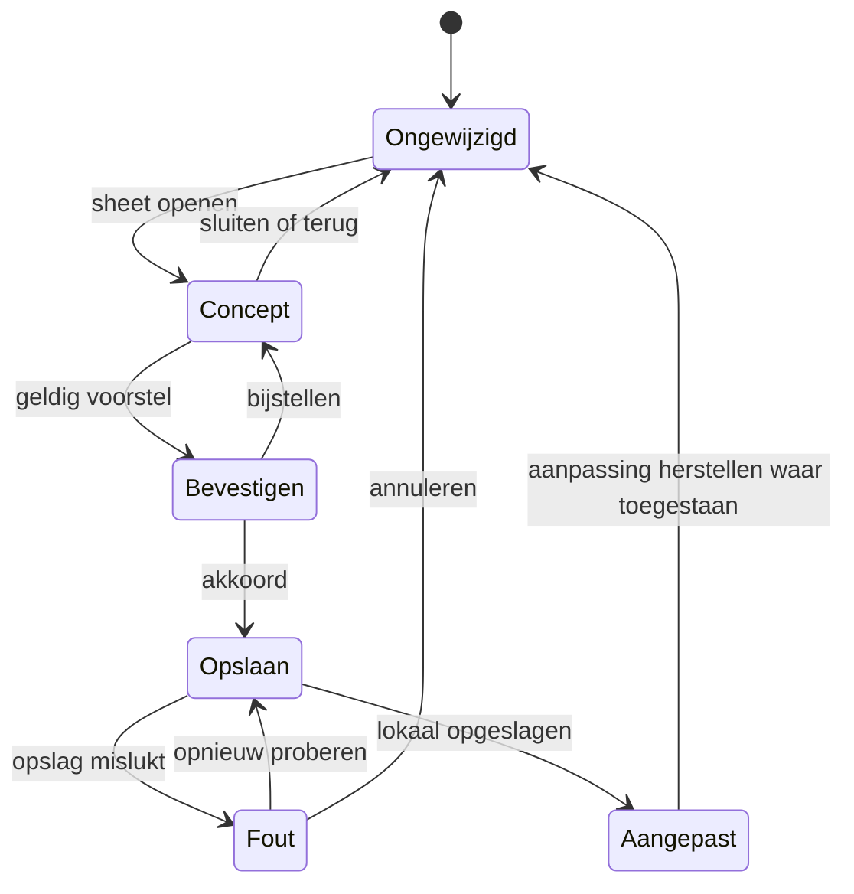

# UC-004 - toestanden

Bij UC-006: pauzeren is hervatbaar, afronden/afbreken is een expliciete eindstatus.
In het klikmodel zijn afspraakverplaatsingen en eindstatussen niet terugdraaibaar; alleen
sessieaanpassingen hebben herstel zolang de uitvoering actief of gepauzeerd is.
