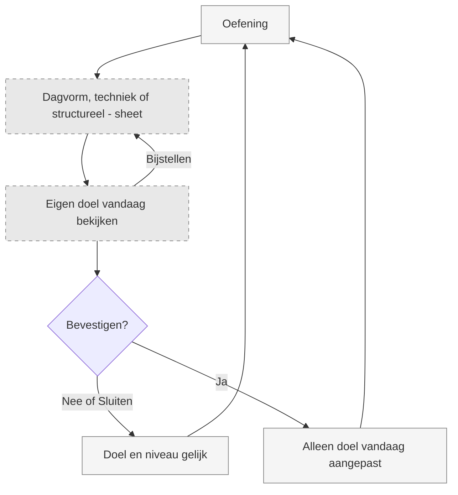

# UC-005 - Te zwaar

```mermaid
flowchart TD
  A[Oefening] --> B[Dagvorm, techniek of structureel - sheet]
  B --> C[Eigen doel vandaag bekijken]
  C --> D{Bevestigen?}
  D -->|Nee of Sluiten| E[Doel en niveau gelijk]
  E --> A
  D -->|Ja| F[Alleen doel vandaag aangepast]
  F --> A
  C -->|Bijstellen| B
  classDef screen fill:#f5f5f5,stroke:#888
  classDef sheet fill:#e8e8e8,stroke:#888,stroke-dasharray:5 5
  class A,F,E screen
  class B,C sheet
```
