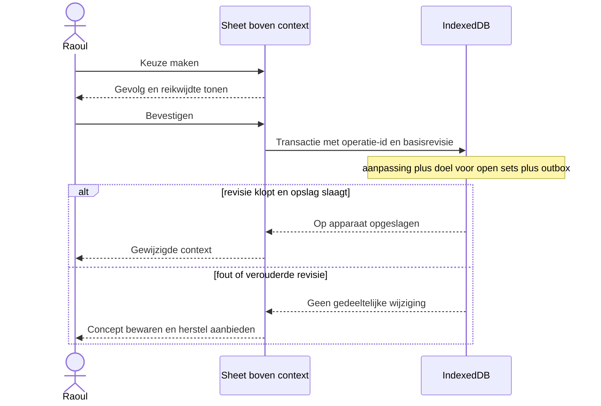

# UC-005 - lokaal schrijven

Contract voor de latere hoofdapp, niet een bewijs van het klikmodel. Geen HTTP/server nodig.

```mermaid
sequenceDiagram
  actor U as Raoul
  participant UI as Sheet boven context
  participant DB as IndexedDB
  U->>UI: Keuze maken
  UI-->>U: Gevolg en reikwijdte tonen
  U->>UI: Bevestigen
  UI->>DB: Transactie met operatie-id en basisrevisie
  Note over DB: aanpassing plus doel voor open sets plus outbox
  alt revisie klopt en opslag slaagt
    DB-->>UI: Op apparaat opgeslagen
    UI-->>U: Gewijzigde context
  else fout of verouderde revisie
    DB-->>UI: Geen gedeeltelijke wijziging
    UI-->>U: Concept bewaren en herstel aanbieden
  end
```
