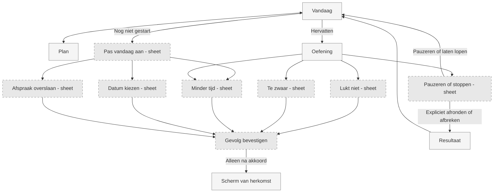

# M3 - schermen en sheets

```mermaid
flowchart TD
  Today[Vandaag] <--> Plan[Plan]
  Today -->|Hervatten| Exercise[Oefening]
  Today -->|Nog niet gestart| Adjust[Pas vandaag aan - sheet]
  Adjust --> Time[Minder tijd - sheet]
  Adjust --> Date[Datum kiezen - sheet]
  Adjust --> Skip[Afspraak overslaan - sheet]
  Exercise --> Swap[Lukt niet - sheet]
  Exercise --> Hard[Te zwaar - sheet]
  Exercise --> Time
  Exercise --> Interrupt[Pauzeren of stoppen - sheet]
  Swap --> Confirm[Gevolg bevestigen]
  Hard --> Confirm
  Time --> Confirm
  Date --> Confirm
  Skip --> Confirm
  Confirm -->|Alleen na akkoord| Origin[Scherm van herkomst]
  Interrupt -->|Pauzeren of laten lopen| Today
  Interrupt -->|Expliciet afronden of afbreken| Summary[Resultaat]
  Summary --> Today
  classDef screen fill:#f5f5f5,stroke:#888
  classDef sheet fill:#e8e8e8,stroke:#888,stroke-dasharray:5 5
  class Today,Plan,Exercise,Summary,Origin screen
  class Adjust,Time,Date,Skip,Swap,Hard,Interrupt,Confirm sheet
```
