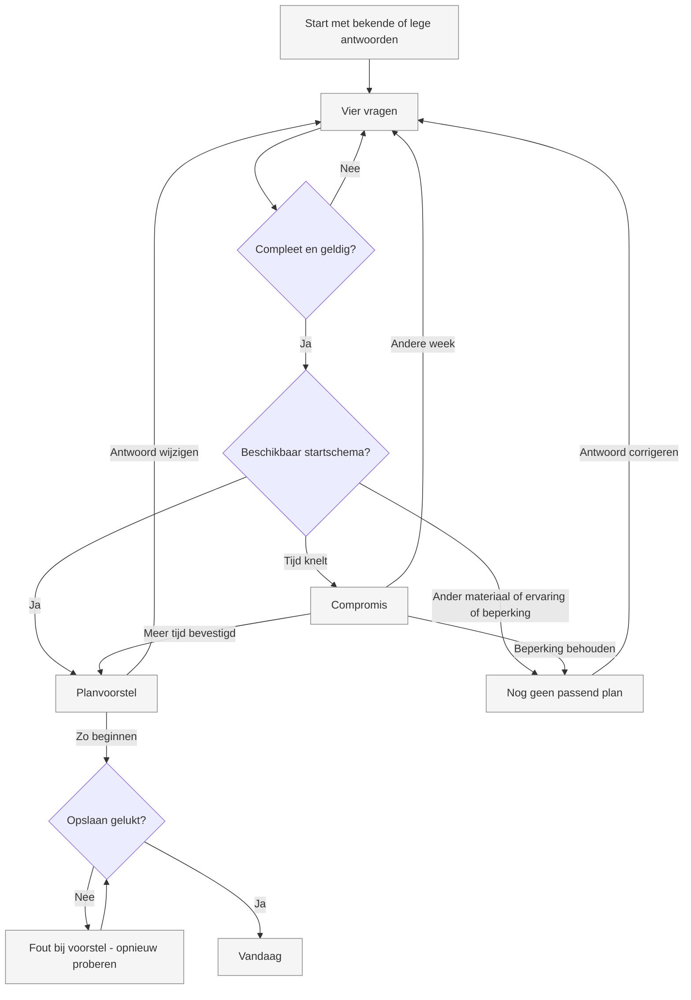

# UC-010 - vier vragen en bewuste bevestiging

```mermaid
flowchart TD
  A[Start met bekende of lege antwoorden] --> B[Vier vragen]
  B --> C{Compleet en geldig?}
  C -->|Nee| B
  C -->|Ja| D{Beschikbaar startschema?}
  D -->|Ja| P[Planvoorstel]
  D -->|Tijd knelt| K[Compromis]
  D -->|Ander materiaal of ervaring of beperking| N[Nog geen passend plan]
  K -->|Meer tijd bevestigd| P
  K -->|Beperking behouden| N
  K -->|Andere week| B
  P -->|Antwoord wijzigen| B
  N -->|Antwoord corrigeren| B
  P -->|Zo beginnen| L{Opslaan gelukt?}
  L -->|Nee| F[Fout bij voorstel - opnieuw proberen]
  F --> L
  L -->|Ja| T[Vandaag]
  classDef screen fill:#f5f5f5,stroke:#888
  class A,B,P,K,N,F,T screen
```
