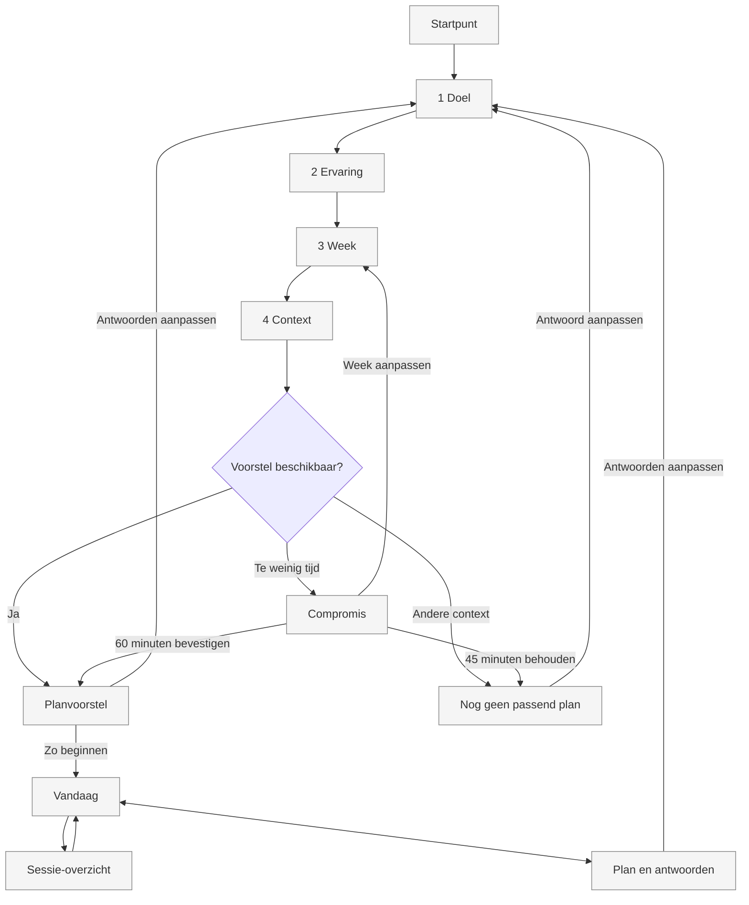

# M4 - schermrollen

UC-010: intake en plan. Vandaag en Plan behouden hun M2-rollen. De infoknop opent een echte
sheet; die is geen nieuwe route. Account en download horen niet in deze lokaal werkende stap.
