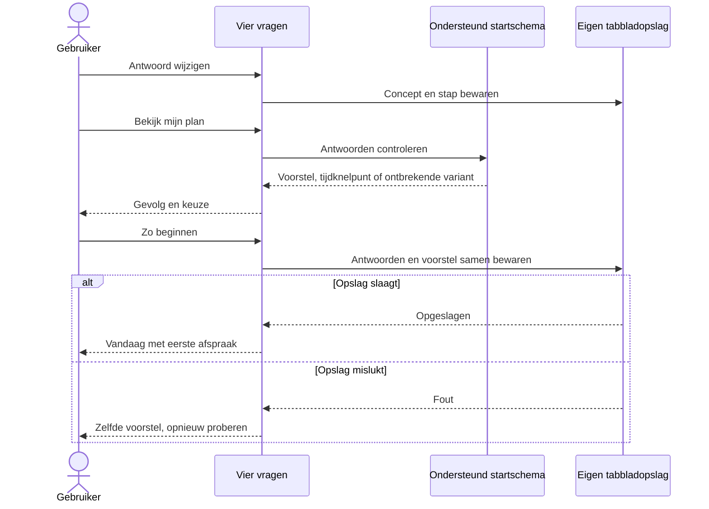

# UC-010 - lokale voorbeeldopslag

Geen HTTP, accountaanmaak of videodownload. Voor de latere hoofdapp moet dit een atomaire
IndexedDB-transactie met planversie, basisrevisie en bescherming van een actieve sessie worden.
