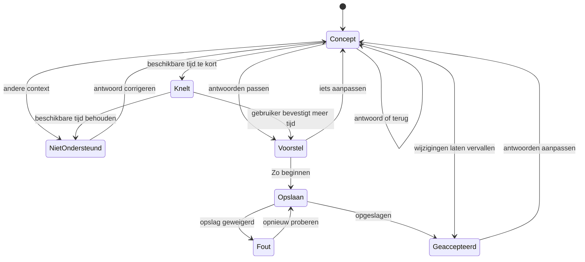

# UC-010 - toestanden

Een geaccepteerd voorbeeld blijft bestaan tijdens het bewerken. Een nieuw concept overschrijft
dit pas na opnieuw 'Zo beginnen'. Echte planversies en actieve sessies vallen buiten het klikmodel.
